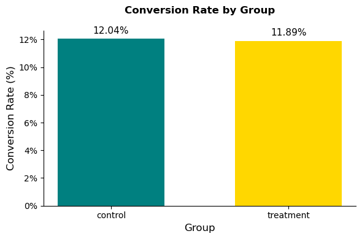
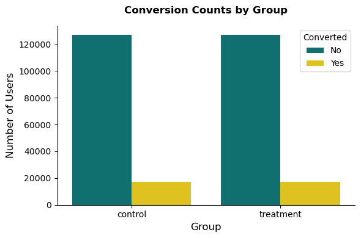
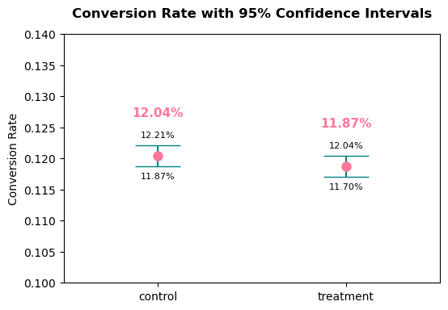

# Bank Loan Landing Page A/B Test  

# Objective  
Evaluate whether a new **landing page** design increases the conversion rate for bank-loan applications compared to the existing control page.  

# Tech Stack  

`Python`  
`Pandas`  
`Numpy`  
`Matplotlib`  
`Seaborn`  
`Scipy`  

<br/><br/>

# 1. Load Dataset and Quick Overview

### Dataset [`ab_data.csv`](data/ab_data.csv)

## Load, Quick Overview

```python
# import libraries
import pandas as pd
import numpy as np

# load dataset
df = pd.read_csv('../data/ab_data.csv')

# Quick structure check
df.info()

# Display first few rows
df.head()
```
```
<class 'pandas.core.frame.DataFrame'>
RangeIndex: 294478 entries, 0 to 294477
Data columns (total 5 columns):
 #   Column        Non-Null Count   Dtype 
---  ------        --------------   ----- 
 0   user_id       294478 non-null  int64 
 1   timestamp     294478 non-null  object
 2   group         294478 non-null  object
 3   landing_page  294478 non-null  object
 4   converted     294478 non-null  int64 
dtypes: int64(2), object(3)
memory usage: 11.2+ MB
```

### Dataset (5 rows, 5 columns)
| user_id | timestamp | group | landing_page | converted |
|---|---|---|---|---|
| 851104 | 2017-01-21 22:11:48.556739 | control | old_page | 0 |
| 804228 | 2017-01-12 08:01:45.159739 | control | old_page | 0 |
| 661590 | 2017-01-11 16:55:06.154213 | treatment | new_page | 0 |
| 853541 | 2017-01-08 18:28:03.143765 | treatment | new_page | 0 |
| 864975 | 2017-01-21 01:52:26.210827 | control | old_page | 1 |

Each record represents a user landing on either the control or treatment page, along with whether they converted (submitted an application).  

### Description

| Column | Description |
|---------|--------------|
| `user_id` | Unique visitor ID |
| `group` | Control / Treatment |
| `landing_page` | Version shown |
| `converted` | 1 = User converted, 0 = Did not convert |

## Basic Sanity Check

```python
## Basic sanity check
print("Number of rows:", len(df))
print("Unique users:", df['user_id'].nunique())
print("Duplicated users:", df['user_id'].duplicated().sum(), "\n")

# Basic group and conversion counts
print(df['group'].value_counts(), "\n")
print(df['converted'].value_counts(), "\n")

# Confirming that `converted` has only 0/1 values, no missing data
df['converted'].value_counts(normalize=True) * 100
print("Numbere of NaN:", df['converted'].isna().sum())
```

```
Number of rows: 294478
Unique users: 290584
Duplicated users: 3894 

group
treatment    147276
control      147202
Name: count, dtype: int64 

converted
0    259241
1     35237
Name: count, dtype: int64 

Numbere of NaN: 0
```

Groups assignment is **balanced** (`treatment` = 147276, `control` = 147202).  
We have **3894** duplicated users, they should be deleted.

<br/><br/>

# 2. Initial Cleaning

- removing duplicate `user_id`s
- dropping rows with mismatching `group`/`landing_page` pairs ('control' = 'old_page', 'treatment' = 'new_page')

```python
# removing duplicated
# sorting by timestamp to leave only first occurrences
df = df.sort_values(by='timestamp')

# dropping duplicates
df = df.drop_duplicates(subset=['user_id'], keep='first')

df = df.sort_values(by='timestamp', ascending=False)

# dropping rows with mismatching group/landing_page pairs
# check mismatched combinations
mismatched = df.query(
    "(group == 'treatment' and landing_page != 'new_page') "
    "or (group == 'control' and landing_page != 'old_page')"
)

print("Number of mismatched rows:", len(mismatched))

# dropping mismatches
df = df.drop(mismatched.index)

# double-check that all combinations are now valid
# checking all the existing combinations in dataset after drop
# should have only two:
# control - old_page
# treatment - new_page
df.groupby('group')['landing_page'].value_counts()
```

```
Number of mismatched rows: 1949
group      landing_page
control    old_page        144319
treatment  new_page        144316
Name: count, dtype: int64
```

<br/><br/>

# 3. Exploratory Data Analysis (EDA)

- Group, Random Assignment Balance & Conversion Overview
- Quick Visualization

## Group & Conversion Overview

```python
# group sizes
group_counts = df['group'].value_counts()
print("Group sizes:\n", group_counts, "\n")

# percentage split
split_ratio = group_counts / group_counts.sum() * 100
print("Sample size ratio (%):\n", split_ratio.round(2), "\n")

# conversion rate by group
conversion_rates = df.groupby('group')['converted'].mean() * 100
print("Conversion rates (%):\n", conversion_rates, "\n")

# Summary DataFrame
summary = pd.DataFrame({
    'Users': df['group'].value_counts(),
    'Converted (%)': df.groupby('group')['converted'].mean() * 100
})
summary['Converted (%)'] = summary['Converted (%)'].round(2)
summary
```

```
Group sizes:
 group
treatment    147276
control      147202
Name: count, dtype: int64 

Sample size ratio (%):
 group
treatment    50.01
control      49.99
Name: count, dtype: float64 

Conversion rates (%):
 group
control      12.039918
treatment    11.891958
Name: converted, dtype: float64  
```

### Conversion Rates by Group

| group | users | Conversion Rate (%) |
| :--- | ---: | ---: |
| control | 144319 | 12.04 |
| treatment | 144316 | 11.87 |

## Conversion Rate Visualization

```python
import matplotlib.pyplot as plt

# Values
groups = conversion_rates.index
rates = conversion_rates.values

plt.figure(figsize=(6,4), facecolor='white')

bars = plt.bar(groups, rates, color=["#008080", "#ffd700"], width=0.6)

# Title and labels (added more top padding)
plt.title('Conversion Rate by Group', fontsize=14, weight='bold', pad=20)
plt.ylabel('Conversion Rate (%)', fontsize=12)
plt.xlabel('Group', fontsize=12)

# Keep only left (y-axis) and bottom (x-axis) spines
ax = plt.gca()
ax.spines['top'].set_visible(False)
ax.spines['right'].set_visible(False)

# Format y-axis with % sign
ax.yaxis.set_major_formatter(plt.FuncFormatter(lambda y, _: f'{y:.0f}%'))

# Remove grid lines
plt.grid(False)

# Add labels on bars
for bar in bars:
    height = bar.get_height()
    plt.text(
        bar.get_x() + bar.get_width() / 2,
        height + 0.25,
        f'{height:.2f}%',
        ha='center',
        va='bottom',
        fontsize=11
    )

plt.tight_layout()
plt.show()
```



<br/><br/>

# 4. Statistical Testing (Two-Proportion Z-Test)

- Two-proportion Z-test, p-value
- Distribution of Conversions (Counts)

We’re testing whether the conversion rate of the `treatment` group (`new_page`) is significantly different from that of the `control` group.

- **H0 (null)** - The new page doesn’t change the conversion rate.
- **H1 (alternativ)** - The new page does change the conversion rate (either up or down).

We’ll test it using a **z-test** for proportions — a standard test when comparing two independent proportions (conversion rates).  
Then we compute the **p-value** from the z-statistic to see if it’s below our significance level *(typically 0.05)*.

## Two-proportion Z-test, p-value

```python
from statsmodels.stats.proportion import proportions_ztest

# conversion counts
control_converted = df.query("group == 'control'")['converted'].sum()
treatment_converted = df.query("group == 'treatment'")['converted'].sum()

# sample sizes
n_control = df.query("group == 'control'").shape[0]
n_treatment = df.query("group == 'treatment'").shape[0]

# run two-proportion z-test
count = np.array([treatment_converted, control_converted])
nobs = np.array([n_treatment, n_control])

stat, pval = proportions_ztest(count, nobs, alternative='two-sided')

print(f"Z-statistic: {stat:.4f}")
print(f"P-value: {pval:.4f}")
```

```
Z-statistic: -1.4036
P-value: 0.1604
```

Since our ``p-value`` **(0.1604)** is greater than the typical significance threshold of **0.05**, we **fail to reject the null hypothesis.**  
There is no statistically significant evidence that the new landing page changed conversion rates. The observed difference could easily be due to random variation in the data.

## Distribution of Conversions (Counts)

```python
import seaborn as sns
import matplotlib.pyplot as plt

# Custom colors
custom_palette = ["#008080", "#ffd700"]  # control, treatment

plt.figure(figsize=(6,4))
sns.countplot(
    data=df,
    x='group',
    hue='converted',
    palette=custom_palette
)
plt.title('Conversion Counts by Group', fontsize=14, weight='bold', pad=15)
plt.xlabel('Group', fontsize=12)
plt.ylabel('Number of Users', fontsize=12)
plt.legend(title='Converted', labels=['No', 'Yes'])
sns.despine()  # removes top/right borders for a clean look
plt.tight_layout()
plt.show()
```



This chart visually supports p-value: both groups (`control` and `treatment`) had similar conversion patterns; no evidences of meaningful improvement achieved by `new_page`.

<br/><br/>

# 5. Confidence Interval Plot (Visualizing Uncertainty)

Once we’ve seen that ``control`` and ``treatment`` look close, the next step is to quantify how confident we are in that difference.  
We’ll calculate and visualize **95% confidence intervals** for each group’s conversion rate — showing the overlap (which visually explains **why p ≈ 0.16 isn't significant**).

```python
import scipy.stats as st
import matplotlib.pyplot as plt
import numpy as np

# Compute conversion rates and confidence intervals
summary = df.groupby('group')['converted'].agg(['mean', 'count'])
summary['std_err'] = np.sqrt(summary['mean'] * (1 - summary['mean']) / summary['count'])
summary['ci_low'], summary['ci_high'] = st.norm.interval(
    0.95, loc=summary['mean'], scale=summary['std_err']
)

# Plot
plt.figure(figsize=(6,4))
plt.errorbar(summary.index, summary['mean'], 
             yerr=summary['mean'] - summary['ci_low'], 
             fmt='o', color="#fe779b", ecolor="#008080", 
             elinewidth=1.5, capsize=20, markersize=8)

plt.title('Conversion Rate with 95% Confidence Intervals')
plt.ylabel('Conversion Rate')
plt.ylim(0.10, 0.14)
plt.xlim(-0.5, len(summary.index) - 0.5)

# Add labels for mean (dot), top and bottom caps
for i, row in summary.iterrows():
    # Dot label (mean)
    plt.text(i, row['mean'] + 0.006, f"{row['mean']:.2%}", 
             ha='center', va='bottom', fontsize=11, fontweight='bold', color="#fe779b")
    # Top cap label
    plt.text(i, row['ci_high'] + 0.001, f"{row['ci_high']:.2%}", 
             ha='center', va='bottom', fontsize=8, color="#000000")
    # Bottom cap label
    plt.text(i, row['ci_low'] - 0.001, f"{row['ci_low']:.2%}", 
             ha='center', va='top', fontsize=8, color="#000000")

plt.show()
```



<br/><br/>

# 6. Lift Analysis (Business Impact)

It shows how much better or worse the treatment performed relative to the control (%).

```python
# Calculate conversion rates
conv_control = summary.loc['control', 'mean']
conv_treatment = summary.loc['treatment', 'mean']

# Calculate lift
lift = (conv_treatment - conv_control) / conv_control * 100
print(f"Lift: {lift:.2f}%")

# Visualize it
plt.figure(figsize=(4,4))
plt.bar(['Lift'], [lift], color="#ffd700")
plt.axhline(0, color='#dbdbdb', linestyle='--')
plt.ylabel('Lift (%)')
plt.title('Relative Improvement (Treatment vs Control)')
plt.text(0, lift + 0.3, f"{lift:.2f}%", ha='center')
plt.show()
```


## Interpretation

Lift shows **−1.41%**, that means:

    The new (treatment) landing page converted about 1.41% fewer users than the original (control).

**However,** since your p-value = 0.16, that **difference isn’t statistically significant** — meaning it could easily be random variation.

<br/><br/>

# 7. Key Results  

| Metric | Control | Treatment |
|---------|----------|-----------|
| Conversion rate | **12.04 %** | **11.87 %** |
| Lift | **−1.41 %** |
| Z-statistic | **−1.4036** |
| p-value | **0.1604** |

## Interpretation:

There is **no statistically significant difference** between the two landing pages (p > 0.05).  
The treatment page performed slightly worse, but the difference is small and could be due to random variation.

## Business Takeaways

- The new landing page **did not outperform** the control.  
- Since the difference is not statistically significant, **keep the control page** for now.    
  
## Business Impact
- Saved potential development costs by identifying non-performing change.
- Prevented ~1.4% potential conversion rate drop.
- Data-driven decision making over subjective design preferences.
